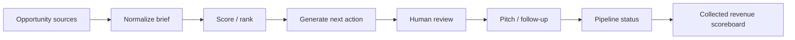

# Revenue Hunter OS

[](https://github.com/Shahzrazaa/revenue-hunter-os/actions/workflows/test.yml)

**Working local prototype · FastAPI · opportunity scoring · pipeline tracking · reviewed outreach**

A local FastAPI command center for turning scattered opportunity research into a ranked action queue, lightweight sales pipeline, and collected-revenue scoreboard.

This is an AI-assisted portfolio project focused on a simple business problem: **finding opportunities is easy; deciding what to pursue and moving it toward paid work is harder.**

## What the prototype does

- Stores opportunities in a local JSON data store
- Scores opportunities using budget, urgency, remote/global fit, source, and service-fit signals
- Generates a low-friction paid-trial pitch
- Tracks pipeline stages: `New → Qualified → Pitched → Replied → Paid / Lost`
- Counts revenue only when an opportunity is explicitly marked **Paid**
- Provides a JSON API at `/api/opportunities`
- Provides a `/health` endpoint
- Shows channel-level targets, pitches, replies, paid outcomes, and collected revenue
- Can send one reviewed message at a time through a locally configured Proton Mail Bridge

The public repository contains **fictional demo opportunities**, not private prospect data.

## Product idea



The current version uses transparent heuristic scoring rather than pretending an LLM is making an objective revenue prediction.

## Quick start

```powershell
pip install -r requirements.txt
python -m uvicorn app.main:app --reload
```

Open:

```text
http://127.0.0.1:8000
```

The included demo data is safe to use as-is.

## Optional Proton Bridge integration

Copy `.env.example` to `.env` and configure your **local Proton Bridge-generated SMTP credentials**.

```text
PROTON_SMTP_HOST=127.0.0.1
PROTON_SMTP_PORT=1027
PROTON_SMTP_USERNAME=...
PROTON_BRIDGE_PASSWORD=...
```

`.env` is ignored by Git. Do not commit SMTP credentials.

The prototype intentionally sends **one reviewed message at a time** rather than bulk outreach.

## Scoring model

The current score begins at a baseline and adds points for signals such as:

- AI / automation / research / e-commerce / marketing fit
- larger or trial-sized budgets
- urgency / immediate buying signals
- worldwide or remote eligibility
- actionable channels such as direct prospects or freelance platforms

This score is a prioritization heuristic, not a probability model.

## Repository structure

```text
.
├── app/main.py                 # FastAPI app + scoring + pipeline + mail integration
├── templates/index.html        # Jinja2 dashboard
├── static/style.css            # UI styling
├── data/opportunities.json     # Fictional demo opportunities
├── tests/test_scoring.py       # Core scoring/pitch tests
├── requirements.txt
├── .env.example
└── .github/workflows/test.yml
```

## Evolution

The project evolved through several experiments (Pushazi / AdSmith AI / Revenue Hunter). I consolidated the public portfolio version under **Revenue Hunter OS** because the underlying product idea is the same: rank opportunities, define a next action, track progress, and optimize for paid outcomes rather than activity volume.

## What I would build next

- permitted API/RSS/import connectors for opportunity ingestion
- persistent database and multi-user accounts
- configurable scoring weights by service line
- LLM-assisted research and personalized messaging behind a review gate
- reply detection and follow-up reminders
- channel-level conversion / ROI reporting
- experiment tracking for pitch variants

## Development approach

I led the product concept, workflow design, scoring logic, iterations, testing, and business framing. AI coding assistants were used during implementation. The project is therefore described as **AI-assisted product development**, not as purely hand-written software engineering.

## Portfolio relevance

This project demonstrates:

**FastAPI · Python · workflow design · lightweight CRM logic · business prioritization · API endpoints · email integration · AI-assisted product iteration**

---

**Author:** Shahzad Raza — IBA Karachi  
**Status:** Working local prototype / portfolio project
